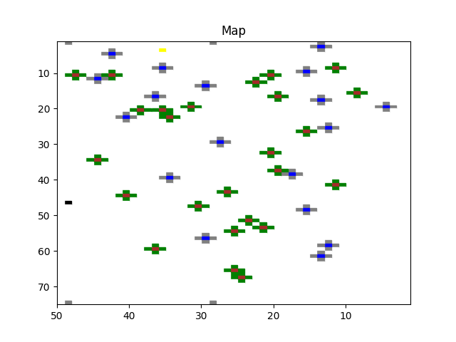
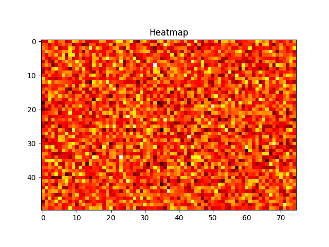
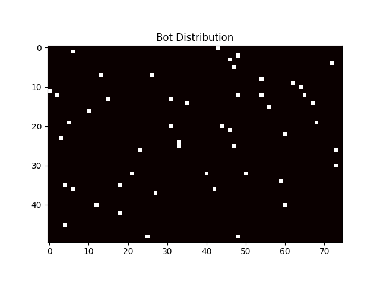

Jonathan Murphy

So far my partner, Salem, and I have worked out a class system for our project. Salem worked on and will talk about the bot class and the hive class. I worked on and will talk about the map and sim class.

The map class is initialized with a given length, width, number of food and number of water spots. Given these parameters the class generates a map, placing a hive in a random place, placing a number of food spots in a random place and the four surrounding tiles to be scent for the food and then places a number of water spots and the four surrounding spots to be a breeze for the water. The map class also has a heatmap so that we can track over time which spots were visited compared to others.

This is an example of a map it could generate. Near the top left is a yellow square which represents the hive. The brown squares are the food. The green squares are a scent which leads the bots to the food. The blue squares is the water. The grey squares are a breeze that leads the bots to the water.

This is an example of a heatmap. For this, I pinged 100000 random x,y coordinates. So the brighter the square, the more it was pinged in comparison to the other coordinates. . The darker the square the less it was pinged in comparison to the other coordinates.

I also worked on the sim class, which holds instances of the map class, the number of bot classes and the hive class. The intention of the sim class is to run the simulation, so it will handle the foraging and searching methods.

Above is an example of randomly distributing the bots across the map. This is similar to the heat map.

Going forward we plan to start implementing the foraging and searching methods. 

The project is also hosted on github here: <https://github.com/MurphyWants/scavenging-sim>
